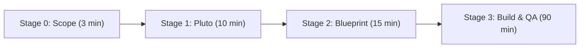

# HACKATHON AGENT RUNBOOK & OPERATIONAL PROTOCOL (Heisenberg OS 3.1)

> **MANDATORY INSTRUCTION FOR ALL AI CODING AGENTS (Antigravity, Qoder, GLM, Kimi, Claude, Cursor):**  
> Read this runbook before writing code. This workspace is pre-engineered for a **high-velocity 3-hour hackathon**. 
> Follow the 4-stage cycle, respect stack invariants, and build upon the existing tested foundation.

---

## 1. What Has Already Been Built & Verified (DO NOT REBUILD)

The core infrastructure is **100% operational, compiled, and live-tested**. Do not recreate boilerplate.

| Subsystem | Location | Status | Key Details |
| :--- | :--- | :--- | :--- |
| **Cloud Database** | `https://xbdhcmkzfzifykkiyccb.supabase.co` | **LIVE & TESTED** | Supabase PostgreSQL + `pgvector` enabled. Tables: `entities`, `embeddings` (HNSW cosine index), `profiles`, plus `match_embeddings` RPC function. |
| **Backend API** | [`Shannons_diary/backend/`](file:///c:/Users/Abdul%20Jabbar%20Metlo/Desktop/Hackathon/Shannons_diary/backend/) | **LIVE & TESTED** | FastAPI on port `8000`. Async routers (`/entities`, `/search`, `/ai`, `/health`). Pydantic v2 schemas. Pre-installed `.venv`. |
| **Frontend Web** | [`Shannons_diary/frontend/`](file:///c:/Users/Abdul%20Jabbar%20Metlo/Desktop/Hackathon/Shannons_diary/frontend/) | **LIVE & TESTED** | Vite + React 18 + TypeScript + Tailwind CSS on port `5173`. High-taste dark UI. 1,610 modules compiled with 0 errors. |
| **Authentication** | Frontend & Supabase | **LIVE & TESTED** | **Google OAuth ("Continue with Google")** active + **1-click "Judge Demo"** bypass button for judges. |
| **Secrets & Safety** | [`.gitignore`](file:///c:/Users/Abdul%20Jabbar%20Metlo/Desktop/Hackathon/.gitignore) | **ACTIVE** | All `.env`, `.venv`, and `node_modules` are strictly ignored. Never commit raw credentials. |

---

## 2. Universal Schema Pattern (Idea-Agnostic)

You **do not need to write SQL migrations** when the hackathon theme is announced. The `entities` table in Supabase contains a flexible **`metadata JSONB`** column:

```typescript
interface Entity {
  id: string;              // UUID
  user_id?: string;        // Owner UUID (auth.users)
  title: string;           // Primary label or headline
  content?: string;        // Body text, transcript, code, or payload
  category: string;        // Partition (e.g. 'general', 'agents', 'finance')
  status: string;          // State ('active', 'completed', 'flagged')
  metadata: Record<string, any>; // Arbitrary domain JSON payload
  is_public: boolean;
}
```

- **If the idea is Fintech:** Store ticker, risk metrics, or portfolio JSON in `metadata`.
- **If the idea is Healthcare:** Store patient vitals, diagnosis, and triage JSON in `metadata`.
- **If the idea is DevTools / Agents:** Store execution trace, token count, and step logs in `metadata`.

---

## 3. The 4-Stage Heisenberg OS Hackathon Cycle

Every feature or product pivot must follow this rapid 4-stage progression:



### Stage 0: 3-Minute Scope Definition (Cold-Start)
Before proposing architectures, extract the **Core MVP Demo Loop**:
1. **User Archetype & Pain:** Who is this for? What single acute problem is solved?
2. **The 3-Step "Aha!" Loop:**  
   - **Input:** What does the user upload, type, or click?
   - **Processing:** What does the backend / AI reasoning engine compute?
   - **Output:** What striking visual result is rendered on screen for the judges?
3. **The Non-Negotiable Cut:** Explicitly identify what we **deliberately cut** to ship in 3 hours (no billing, no multi-tenant orgs, no complex settings).

### Stage 1: Narrsistic Pluto (`skills/core/narrsistic-pluto/SKILL.md`)
- The agent outputs `architecture-analysis.md`.
- Formulates **6 distinct, creative engineering approaches** dynamically tailored to the specific problem.
- Evaluates complexity, trade-offs, blast radius, and rejection rationale.
- The **Human Director selects the winning approach**.

### Stage 2: Converged Task Blueprint (`skills/core/converged-task-blueprint/SKILL.md`)
- The agent authors `task_blueprint.md` (200+ lines):
  1. *Understanding & Mental Model*: Physical analogy, zero-magic trace.
  2. *CS Invariants & Data Structures*: Big-O performance, memory backpressure.
  3. *10-Point Architectural Grill*: Concurrency, partial failures, security, latency boundaries.
  4. *Exact File Manifest*: Line-level file targets, Pydantic & TypeScript contracts.
  5. *Rollback Runbook*: 60-second revert strategy.

### Stage 3: Implementation & Active Verification (`skills/core/testing-verification/SKILL.md`)
- **Coding Agents Build**: Implement UI and backend endpoints.
- **Active QA Verification**: The agent generates and executes `verification.md`:
  - Unit tests
  - **10 Edge Cases** tested
  - **10 Failure Cases** tested
  - End-to-end integration flow verified
  - Contract audit between FastAPI schemas and React TypeScript interfaces
  - Self-healing flaw resolution before declaring complete.

---

## 4. UI Taste & Frontend Rules (Strict Anti-Slop Policy)

When implementing the frontend, every agent **MUST** follow [`Heisenberg OS/UItasteskills/design-taste-frontend/SKILL.md`](file:///c:/Users/Abdul%20Jabbar%20Metlo/Desktop/Hackathon/Heisenberg%20OS/UItasteskills/design-taste-frontend/SKILL.md):

1. **Anti-Default Discipline:**
   - ❌ NO generic AI-purple gradients on dark mesh cards.
   - ❌ NO 3 equal cards with identical icons.
   - ❌ NO infinite micro-animations spinning aimlessly.
   - ✅ Clean typography pairing: Plus Jakarta Sans for UI + JetBrains Mono for metrics/code.
   - ✅ High-contrast border borders (`border-neutral-800`), crisp contrast, tactile hover states (`active:scale-[0.98]`).
2. **Three Dials Baseline:**
   - `DESIGN_VARIANCE: 8` (High visual distinction)
   - `MOTION_INTENSITY: 5` (Subtle, functional transitions)
   - `VISUAL_DENSITY: 4` (Clean, balanced layout; not too cramped, not too sparse)
3. **Accessibility & Touch Ergonomics:**
   - Touch targets $\ge 44 \times 44\text{px}$.
   - Text contrast meets WCAG AA standards against dark backgrounds.

---

## 5. Multi-Agent Team Collaboration Matrix

| Role | Assigned To | Primary Responsibilities |
| :--- | :--- | :--- |
| **Product Director & Judge** | **User (Human)** | Defines theme, approves winning Pluto approach, performs live user acceptance testing. |
| **System Architect & QA** | **Antigravity (Gemini)** | Executes Pluto analysis, authors Converged Blueprint, builds backend routers, runs 20-point verification suite. |
| **Frontend Specialist** | **Alibaba Qoder (GLM / Kimi)** | Crafts React UI, adheres to `UItasteskills`, handles animations, responsive layouts, and visual hierarchy. |

---

## 6. Daily Operations Cheat Sheet

### Start Backend Server:
```powershell
cd "c:\Users\Abdul Jabbar Metlo\Desktop\Hackathon\Shannons_diary\backend"
.venv\Scripts\activate
uvicorn app.main:app --reload --port 8000
```
- Swagger Docs: [http://localhost:8000/docs](http://localhost:8000/docs)
- Health Check: [http://localhost:8000/health](http://localhost:8000/health)

### Start Frontend Server:
```powershell
cd "c:\Users\Abdul Jabbar Metlo\Desktop\Hackathon\Shannons_diary\frontend"
.\node_modules\.bin\vite.cmd --port 5173
```
- Web Application: [http://localhost:5173](http://localhost:5173)

### Verify Build Before Demo:
```powershell
cd "c:\Users\Abdul Jabbar Metlo\Desktop\Hackathon\Shannons_diary\frontend"
.\node_modules\.bin\vite.cmd build
```

---

## 7. Golden Rules for Agents

1. **Do Not Overwrite `.env`**: Credentials are live and valid. Never replace them with placeholders.
2. **Do Not Block Edits**: Heisenberg guard policy is set to `"mode": "advisory"`. Do not refuse file edits due to missing non-critical receipts.
3. **Keep the "Judge Demo" Button**: On demo day, judges need 1-click access. Never remove the demo bypass button from the header.
4. **Speed Over Bureaucracy**: Maintain thoroughness in the blueprint and tests, but do not waste time creating redundant markdown documents outside the 3 core artifacts (`architecture-analysis.md`, `task_blueprint.md`, `verification.md`).
