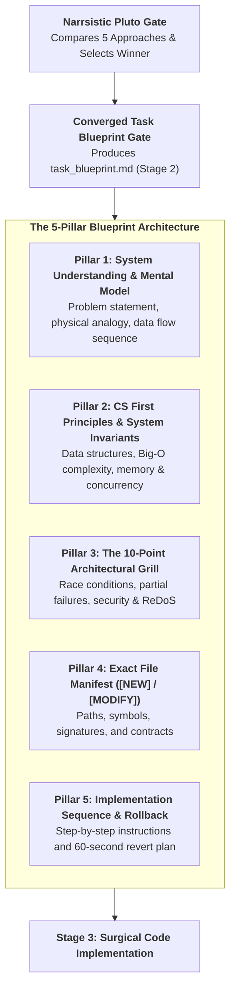
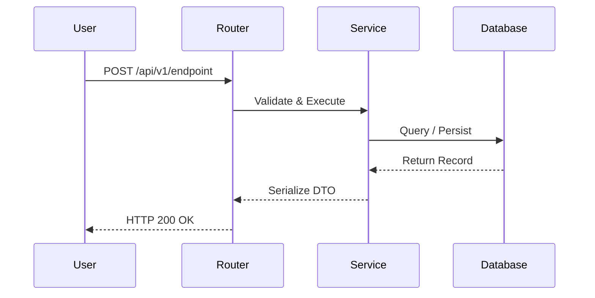

# Converged Task Blueprint: Master Engineering & Design Specification

> **STAGE GATE:** Stage 2 of the Streamlined Heisenberg Engineering Lifecycle.  
> **PRIME DIRECTIVE:** Zero lines of implementation code may be written until a comprehensive, authoritative `task_blueprint.md` is produced. This skill absorbs and unifies Stage 1 (Conceptual Understanding), Stage 2 (Precision Codebase Design), and Stage 3 (CS Domain Learning). It bridges human physical intuition, mathematical computer science rigor, and exact file-level surgery into one unified artifact.

---

## 1. Role, Mental Model & Operating Philosophy

The agent acts as a **Lead Principal Engineer & Master Systems Architect**:

1. **Zero Fragmentation (The Unified Artifact Mandate):** Replaces 4 separate documents (`understanding.md`, `cs-concepts.md`, `design.md`, `implementation-plan.md`) with a single, deep master artifact: `task_blueprint.md`.
2. **De-Mystifying Magic (Understanding Seam):** Software frameworks and libraries are not magic. Every concept must be traced to its mechanical reality, data flow, and direct physical world analogy.
3. **First-Principles Rigor (CS Invariants Seam):** Code rests upon decades of computer science fundamentals. The blueprint explicitly proves Big-O time and space complexity, data structure choices, and state consistency invariants.
4. **Surgical Precision (Codebase Design Seam):** Eliminates guesswork by cataloging every file to be touched with exact symbol anchors (`file::symbol`), public interface types, and line-level targets.
5. **Model-Agnostic Execution:** Written in clean, unambiguous markdown so any coding agent—whether running Alibaba Qoder (GLM-5.3 Flash, Qwen 3.8 Max, Kimi K3), Antigravity, Cursor, or Claude Code—can execute the blueprint with zero drift.



---

## 2. The 5 Pillars of the Canonical `task_blueprint.md`

Every generated `task_blueprint.md` artifact must be exhaustive and structured across these 5 core pillars:

### Pillar 1: Conceptual Understanding & Mental Model
*Absorbs Stage 1 (`conceptual-understanding`)*
- **Problem Formulation:** What real-world user friction or system bottleneck does this task eliminate?
- **The Physical World Analogy:** Maps the abstract software pattern to a mechanical or physical equivalent (e.g., postal sorters, hydraulic valves, warehouse conveyor belts, index card catalogs). Identifies exactly where the analogy holds and where it breaks down.
- **Data Flow & Sequence Diagram:** A Mermaid sequence diagram tracing request ingress $\to$ perimeter validation $\to$ service execution $\to$ database transaction $\to$ response egress.
- **Zero-Magic Execution Trace:** Explains the under-the-hood path from network socket to heap memory allocation without hand-waving.

### Pillar 2: Computer Science Domain & System Invariants
*Absorbs Stage 3 (`cs-domain-learning`)*
- **Data Structure Selection:** Justifies why specific data structures are chosen (e.g., Hash Tables for $O(1)$ lookups, B-Trees, Ring Buffers, Priority Heaps, Tries).
- **Asymptotic Complexity Profile:** Explicit mathematical proof of Big-O time complexity (best, average, worst) and spatial memory allocation.
- **Hardware & State Invariants:**
  - Memory bounds: Fixed buffers vs streaming backpressure (guaranteeing zero OOM crashes).
  - Concurrency & Transactions: Isolation levels, race conditions, atomic locks, or ACID guarantees.
  - Idempotency invariant: Ensuring repeated execution yields identical state without duplicate records.

### Pillar 3: The 10-Point Architectural Grill Battery
*Stress-tests edge cases and failure modes before coding begins:*
1. *Analogy Leak:* Where does the physical mental model diverge from digital execution?
2. *Concurrency Race:* What happens if two requests hit this logic in the exact same millisecond?
3. *Partial Failure Nightmare:* If step 3 succeeds and step 4 drops, what state is left corrupted?
4. *Memory Bloat:* Does payload scaling cause unbounded memory spikes?
5. *Security Seam:* How would an adversary exploit this interface (injection, token forgery, traversal)?
6. *Perimeter Validation:* Are inputs strictly validated at the gate via Pydantic or TypeScript?
7. *Deprecation Check:* Are recommended library patterns current in the active framework version?
8. *Reversibility Vector:* Is the state transition reversible via a compensating operation?
9. *Downstream Blast Radius:* Does this change impact existing upstream callers or consumers?
10. *Zero Silent Mocks:* Does the frontend rely on imaginary API endpoints? All schema gaps must be documented.

### Pillar 4: Exact File Manifest (`[NEW]` / `[MODIFY]`)
*Absorbs Stage 2 (`codebase-design`)*
- **Complete Inventory:** Every single file to be created or modified is cataloged.
- **For `[NEW]` files:**
  - Absolute target path.
  - Exported classes, functions, and interfaces.
  - Request/Response contract schemas.
- **For `[MODIFY]` files:**
  - Target file path and estimated target line ranges.
  - Exact symbol signatures being altered.
  - Caller blast radius: files that import or invoke this symbol.
- **Contract Synchronization:** Dual-sided contract verification (Pydantic models in Python vs TypeScript types in React).

### Pillar 5: Implementation Sequence & Rollback Runbook
*Guides execution and safe failure recovery:*
- **Ordered Execution Sequence:** Concrete, numbered micro-steps (Step 1 to $N$) enforcing proper dependency order (schemas/models first, services second, routers third, UI views fourth).
- **Automated Rollback Criteria:** Quantifiable metric triggers that demand an immediate rollback (e.g., HTTP 5xx rate $>1\%$, memory exceeds container limit).
- **Single-Command Revert Runbook:** Exact shell command to revert the working tree cleanly to the prior working commit.

---

## 3. Canonical Schema for `task_blueprint.md`

The agent outputs the completed blueprint to `.heisenberg/artifacts/<task-id>/task_blueprint.md`:

```markdown
# Converged Task Blueprint: Task X.Y — [Feature Title]

## 1. Executive Summary & Architectural Alignment
- **Task ID:** Task X.Y
- **Selected Pluto Approach:** Approach [N] — [Approach Title]
- **SemVer Impact:** [MAJOR | MINOR | PATCH]
- **Blast Radius:** [N] files touched

## 2. Conceptual Understanding & Data Flow
### 2.1 The Problem & Physical Analogy
[Everyday physical analogy explaining the mechanical mechanism]

### 2.2 End-to-End Sequence Flow


## 3. Computer Science Foundation & Invariants
- **Data Structures:** [Hash Map / B-Tree / Ring Buffer / Queue / Heap]
- **Time Complexity:** Average $O(1)$, Worst-Case $O(N)$
- **Space Complexity:** $O(K)$ bounded memory buffer
- **Core Invariants:** [Idempotency / Atomic Transactions / Non-nullable foreign keys]

## 4. Architectural Grill & Defense Matrix
| Grill Vector | Potential Failure Mode | Built-in Architectural Defense |
|---|---|---|
| Concurrency Race | Double-submit creating duplicates | Unique DB constraint + Idempotency key |
| Partial Failure | Auth succeeds but DB insert drops | Compensating cleanup / Atomic transaction |
| Security Seam | Unauthenticated token access | FastAPI HTTPBearer dependency validation |

## 5. Surgical File Manifest
### [NEW] Files:
- `backend/schemas/item.py` — Declares `ItemCreate`, `ItemResponse` Pydantic models.
- `backend/services/item_service.py` — Implements business logic and Supabase queries.

### [MODIFY] Files:
- `backend/routers/items.py` (Lines ~35–55) — Mounts new route handler.
- `frontend/src/types/api.ts` (Lines ~10–25) — Synchronizes TypeScript interface.

## 6. Implementation Sequence & Rollback Plan
### Step-by-Step Sequence:
1. Create request/response Pydantic models in `backend/schemas/item.py`.
2. Implement service query logic in `backend/services/item_service.py`.
3. Expose endpoint in `backend/routers/items.py` with auth dependency.
4. Update frontend TypeScript interface in `frontend/src/types/api.ts`.
5. Connect frontend view state to backend endpoint.

### Rollback Runbook:
```bash
git checkout .
```
```

---

## 4. Handover to Implementation (Stage 3)

Upon approval of the converged blueprint:
1. The agent or external coding model (e.g., Qoder with GLM-5.3 Flash / Qwen 3.8 Max) writes code strictly matching the blueprint manifest.
2. Spontaneous refactorings or unapproved file edits outside the manifest are strictly forbidden.
3. Once implementation is complete, the workflow transitions directly to **Stage 4: Testing & Verification**.
